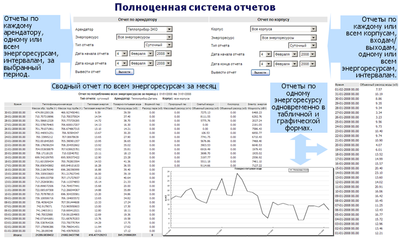
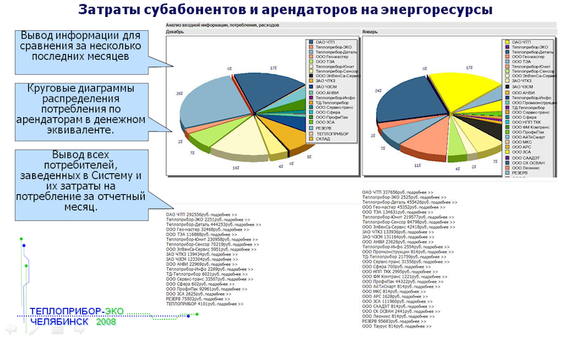

Система технического учета энергоресурсов АСКУЭР. Комплекс программного обеспечения, для системы из 70 узлов учета тепловой энергии, природного газа, пожарно-питьевой воды, кислорода, сжатого воздуха, пара, электричества. Система развернута на заводе и ведет учет по всем корпусам и объектам предприятия, арендаторам. Состоит из двух серверов сбора данных с контроллерного уровня, двух клиентов БД, интерфейса пользователей, модуля собора данных с узлов коммерческого учета. Система позволяет получать подробные отчеты по арендаторам системы (всем помещениям и агрегатам), корпусам, различным временным интервалам в виде графиков, гистограмм и диаграмм. Предусматривает вывод на печать и генерацию счетов для арендаторов.
  

  

  

  

  

  

